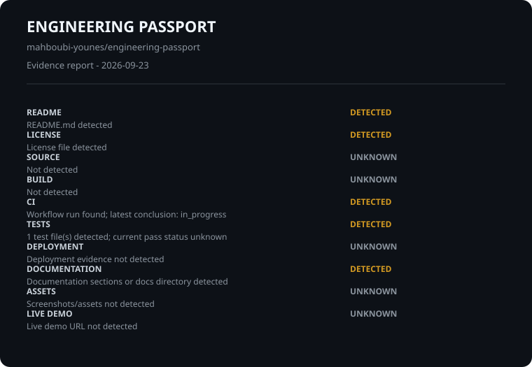

# Engineering Passport

Repository: mahboubi-younes/engineering-passport

Evidence-first report. This is not a quality score or ranking.

## Evidence

- **README** | DETECTED | README.md detected
- **LICENSE** | DETECTED | License file detected
- **SOURCE** | UNKNOWN | Not detected
- **BUILD** | UNKNOWN | Not detected
- **CI** | DETECTED | Workflow run found; latest conclusion: in_progress
- **TESTS** | DETECTED | 1 test file(s) detected; current pass status unknown
- **DEPLOYMENT** | UNKNOWN | Deployment evidence not detected
- **DOCUMENTATION** | DETECTED | Documentation sections or docs directory detected
- **ASSETS** | UNKNOWN | Screenshots/assets not detected
- **LIVE DEMO** | UNKNOWN | Live demo URL not detected

## Technologies

JavaScript

## Verification context

- Generated: 2026-09-23T11:11:02.713Z
- GitHub API: Repository metadata read from GitHub API

Unknown means evidence was unavailable; no claim is made.
